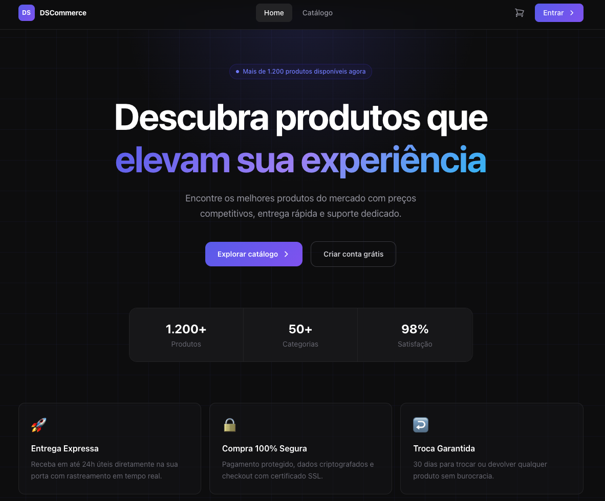
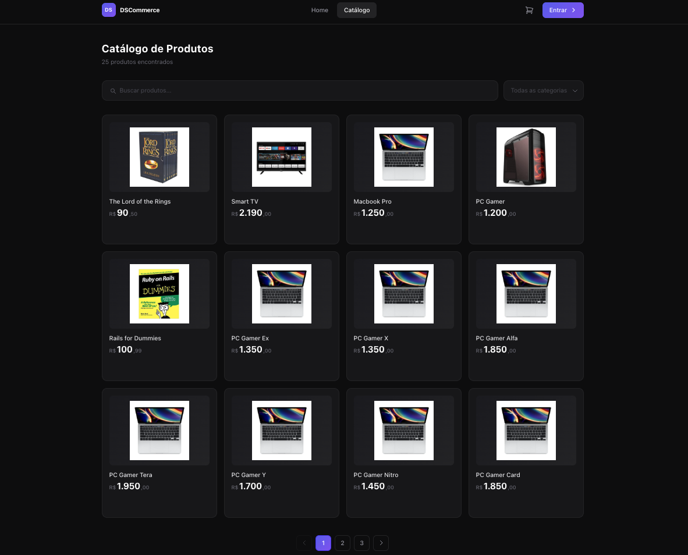
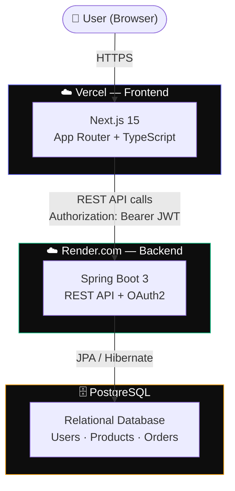
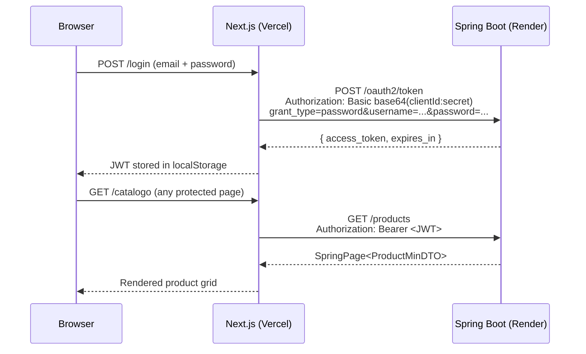

# DSCommerce — Frontend

[](https://dscommerce-frontend-git-main-mateusribeirocampos-projects.vercel.app)
[](https://nextjs.org)
[](https://www.typescriptlang.org)
[](https://tailwindcss.com)

A modern, dark-themed e-commerce frontend built with **Next.js 15 App Router** and **Tailwind CSS v4**, fully integrated with a [Java Spring Boot REST API](https://github.com/mateusribeirocampos/project-spring-boot-dscommerce).

---

## Screenshots

| Home | Catalog |
|------|---------|
|  |  |

> **Note:** Save screenshots to `public/screenshots/home.png` and `public/screenshots/catalog.png` to render this section.

---

## Architecture



### Authentication flow



---

## Tech Stack

| Layer | Technology |
|-------|-----------|
| Framework | Next.js 15 (App Router) |
| Language | TypeScript 5 |
| Styling | Tailwind CSS v4 |
| Auth | OAuth2 Password Grant + JWT (Spring Authorization Server) |
| State | React Context API + `localStorage` |
| HTTP | Native `fetch` with typed wrapper (`apiFetch`) |
| Backend | Spring Boot 3 on [Render.com](https://project-spring-boot-dscommerce.onrender.com) |
| Database | PostgreSQL (via Render managed database) |

---

## Features

- **Home** — landing page with hero, stats and CTA
- **Catalog** — paginated product grid with real-time name search and category dropdown
- **Product detail** — full page with image, price, description, categories and Add to Cart
- **Cart** — persisted in `localStorage`, quantity controls, subtotal per item and order total
- **Authentication** — JWT login via OAuth2 password grant, token decoded client-side for role extraction
- **Registration** — new account creation via `POST /users/register`
- **User profile** — view and edit personal data (`GET /PUT /users/me`)
- **Admin area** — protected by `ROLE_ADMIN`, guards via Client Component layout
  - Product list with debounced search, pagination with ellipsis, delete confirmation modal
  - Create new product with category multi-select and image URL preview
  - Edit existing product (shared form component via discriminated union props)

---

## Project Structure

```
src/app/
├── layout.tsx              # Root layout — Navbar + AuthProvider + CartProvider
├── page.tsx                # / — Hero landing page
├── catalogo/               # /catalogo — Product grid with search + filter
├── produto/[id]/           # /produto/:id — Product detail (Server Component)
├── cart/                   # /cart — Cart management + checkout
├── login/                  # /login — OAuth2 login form
├── register/               # /register — New account registration
├── profile/                # /profile — User profile view + edit
├── admin/
│   ├── layout.tsx          # Auth guard — redirects non-admins to /login
│   ├── page.tsx            # Redirect → /admin/produtos
│   └── produtos/
│       ├── page.tsx        # Product list (search, paginate, delete)
│       ├── ProductForm.tsx # Shared create/edit form (discriminated union props)
│       ├── novo/page.tsx   # Create product
│       └── [id]/editar/    # Edit product (Server Component fetches product)
├── components/
│   ├── Navbar.tsx          # Sticky nav — cart badge, auth dropdown, admin link
│   ├── ProductCard.tsx     # Reusable product card
│   ├── AddToCartButton.tsx # Client Island for cart interaction
│   └── Providers.tsx       # AuthProvider + CartProvider wrapper
├── context/
│   ├── AuthContext.tsx     # JWT hydration, token decode, hydrated flag
│   └── CartContext.tsx     # Cart state + localStorage persistence
├── services/               # Typed API wrappers (one file per resource)
│   ├── authService.ts      # POST /oauth2/token
│   ├── productService.ts   # CRUD /products
│   ├── categoryService.ts  # GET /categories
│   ├── userService.ts      # GET + PUT /users/me, POST /users/register
│   └── orderService.ts     # POST + GET /orders
├── lib/
│   └── api.ts              # apiFetch wrapper + ApiError class
└── types/
    └── index.ts            # All DTOs — mirrors Spring Boot backend exactly
```

---

## Getting Started

### Prerequisites

- Node.js ≥ 22
- Running Spring Boot backend (local or Render.com)

### Install & run

```bash
git clone https://github.com/mateusribeirocampos/dscommerce-frontend.git
cd dscommerce-frontend
npm install
cp .env.example .env.local   # fill in the values
npm run dev                   # http://localhost:3000
```

### Environment variables

| Variable | Description | Default (dev) |
|----------|-------------|---------------|
| `NEXT_PUBLIC_API_URL` | Spring Boot API base URL | `http://localhost:8080` |
| `NEXT_PUBLIC_OAUTH_CLIENT_ID` | OAuth2 client ID registered in Spring | `myclientid` |
| `NEXT_PUBLIC_OAUTH_CLIENT_SECRET` | OAuth2 client secret | `myclientsecret` |

> These values must match `CLIENT_ID` and `CLIENT_SECRET` on the Render backend.
> Variables prefixed with `NEXT_PUBLIC_` are **embedded at build time** and visible in the browser bundle.

### Development accounts

The backend seed file (`import.sql`) creates two users for local testing:

| Account | Email | Password | Roles |
|---------|-------|----------|-------|
| Maria Brown | `maria@gmail.com` | `123456` | `ROLE_CLIENT` |
| Alex Green | `matcamp1981@gmail.com` | `123456` | `ROLE_ADMIN` + `ROLE_CLIENT` |

Use Alex's credentials to access the `/admin` area.

---

## API Integration

The frontend communicates with the Spring Boot backend through a typed service layer. All protected endpoints send `Authorization: Bearer <JWT>`.

| Service | Method | Endpoint | Auth |
|---------|--------|----------|------|
| `authService` | `POST` | `/oauth2/token` | Basic (clientId:secret) |
| `productService` | `GET` | `/products` | Public |
| `productService` | `GET` | `/products/{id}` | Public |
| `productService` | `POST` | `/products` | ROLE_ADMIN |
| `productService` | `PUT` | `/products/{id}` | ROLE_ADMIN |
| `productService` | `DELETE` | `/products/{id}` | ROLE_ADMIN |
| `categoryService` | `GET` | `/categories` | Public |
| `userService` | `POST` | `/users/register` | Public |
| `userService` | `GET` | `/users/me` | ROLE_CLIENT / ROLE_ADMIN |
| `userService` | `PUT` | `/users/me` | ROLE_CLIENT / ROLE_ADMIN |
| `orderService` | `POST` | `/orders` | ROLE_CLIENT |
| `orderService` | `GET` | `/orders/{id}` | ROLE_CLIENT / ROLE_ADMIN |

---

## Deployment

### Frontend — Vercel

1. Push to GitHub
2. Import the repo in [vercel.com/new](https://vercel.com/new)
3. Set environment variables in **Settings → Environment Variables**:

```
NEXT_PUBLIC_API_URL=https://project-spring-boot-dscommerce.onrender.com
NEXT_PUBLIC_OAUTH_CLIENT_ID=myclientid
NEXT_PUBLIC_OAUTH_CLIENT_SECRET=myclientsecret
```

4. Deploy → Vercel generates a stable branch URL (`-git-main-...vercel.app`)

### Backend CORS — Render.com

After deploying the frontend, add the Vercel domain to the backend's `CORS_ORIGINS` environment variable on Render:

```
CORS_ORIGINS=https://your-app.vercel.app,https://your-app-git-main-...vercel.app,http://localhost:3000
```

The Spring Boot backend reads this via `@Value("${cors.origins}")` in `ResourceServerConfig.java` and passes it to `setAllowedOriginPatterns()`, which supports wildcards:

```
CORS_ORIGINS=https://*-mateusribeirocampos-projects.vercel.app,http://localhost:3000
```

---

## Scripts

```bash
npm run dev     # Development server — http://localhost:3000 (Turbopack)
npm run build   # Production build (runs TypeScript check)
npm start       # Start production server
npm run lint    # ESLint
```

---

## Related

- [DSCommerce Backend](https://github.com/mateusribeirocampos/project-spring-boot-dscommerce) — Spring Boot 3 · Spring Security · OAuth2 · PostgreSQL
